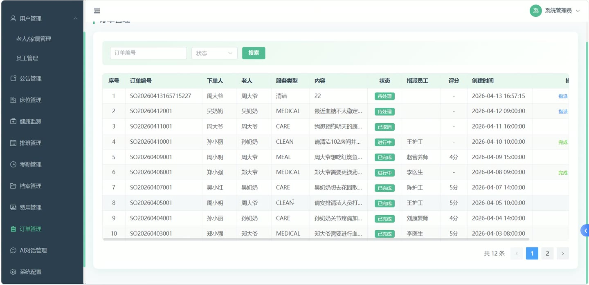
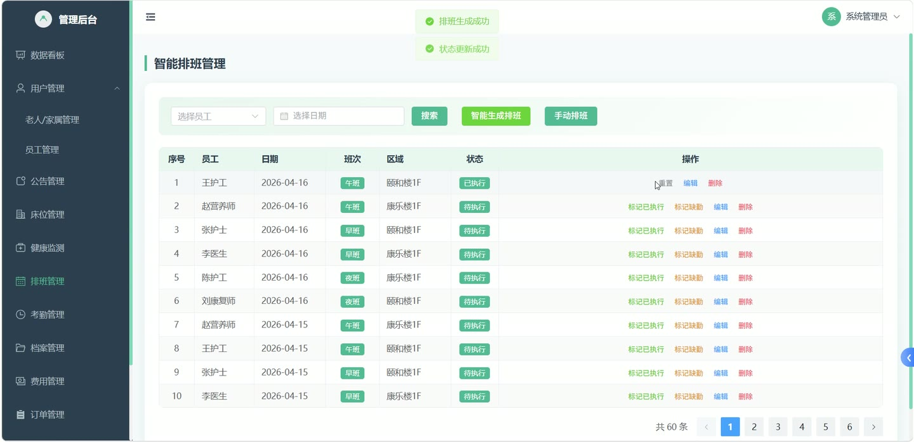
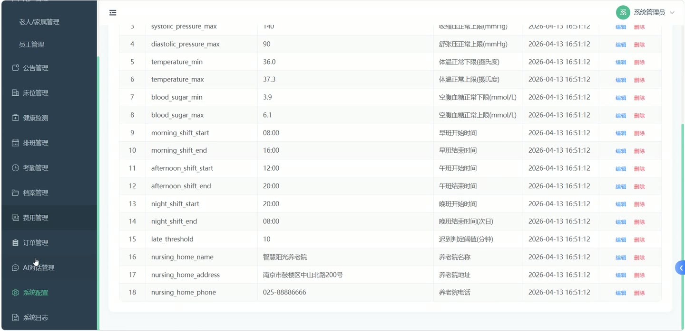
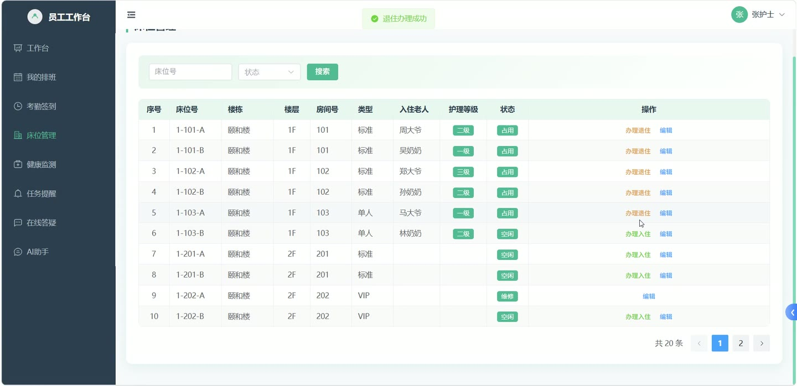
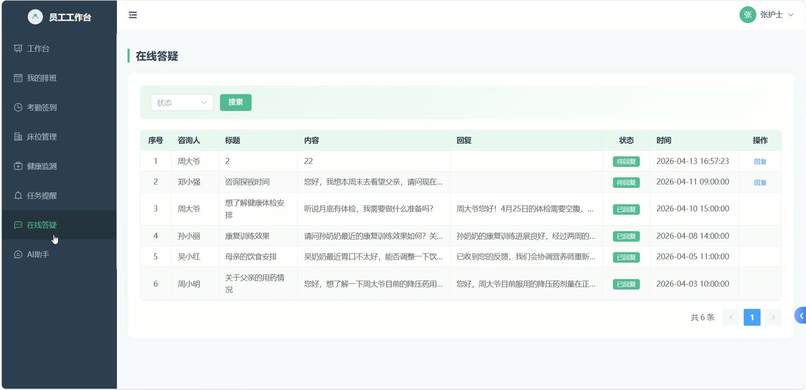

# (附文档)Springboot3+Vue3+MySQL 智慧养老院管理系统

**技术栈**：Springboot3、Vue3、MySQL

### 系统简介

智慧养老院管理系统是一套前后端分离的养老机构综合管理平台，采用 Spring Boot 3 + Vue 3 + MySQL 架构，支持管理员、员工（护理人员）、老人及家属三种角色。系统覆盖床位管理、健康监测、服务订单、费用管理、考勤排班、紧急求助、在线咨询、AI 智能对话等养老院核心业务场景，提供数据看板与报表导出功能，帮助养老院实现数字化运营管理。
 
### 核心功能
 
### 管理员端

 
- 查看首页数据看板，统计老人数量、员工数量、家属数量、床位使用率、健康异常率、待处理订单数、待处理紧急求助数、本月考勤统计等核心指标 
- 管理用户账户，支持新增用户、编辑用户信息、启用/禁用用户、重置用户密码为 123456、删除用户，按姓名/角色筛选用户列表 
- 管理床位信息，支持新增/编辑/删除床位，按床位编号/楼栋/状态筛选，查看床位统计（总床位数、已入住/空闲/维修数量） 
- 办理老人入住，选择床位并关联老人，设置护理等级；办理退住，释放床位资源 
- 管理老人档案，按老人姓名/护理等级搜索，支持新增/编辑/删除档案，若该老人已有档案则自动更新 
- 管理健康记录，查看全院健康数据列表，按老人/是否异常筛选，录入/编辑/删除健康数据，系统根据阈值自动判断异常 
- 管理服务订单，查看全部订单列表，按订单号/用户/状态筛选，指派员工处理订单、完成订单、取消订单 
- 管理费用账单，新增/编辑/删除费用，按老人/费用类型/状态筛选，执行缴费操作，查看费用统计（应收/已收/未收金额） 
- 管理公告通知，发布/编辑/删除公告，支持按标题/类型筛选，前台只展示已发布公告，系统自动统计阅读次数 
- 管理员工考勤，查看考勤记录列表，按员工/日期/状态筛选，查看考勤统计（正常/迟到/早退/缺勤次数） 
- 管理排班计划，新增/编辑/删除排班，支持智能生成指定日期范围的排班方案，按员工/日期/班次筛选 
- 管理紧急求助，查看求助列表，按老人/状态筛选，处理求助并填写处理结果 
- 管理在线咨询，查看咨询列表，按用户/状态筛选，回复咨询内容 
- 管理服务任务提醒，新增/编辑/删除任务，按员工/任务类型/状态筛选 
- 管理系统配置，新增/编辑/删除系统配置项，按 key 获取配置值（如养老院名称/地址/电话、健康阈值、考勤时间等） 
- 查看系统操作日志，按用户名/操作类型筛选，支持单条删除和批量删除日志 
- 管理 AI 对话记录，分页查看全部用户的对话历史，按用户 ID/会话 ID 筛选，删除对话记录 
- 导出健康记录报表为 Excel，导出考勤记录报表为 Excel
 
### 员工端（护理人员）

 
- 查看个人排班信息，按日期范围查询自己的排班计划 
- 进行每日签到，记录签到时间与定位，系统自动判断是否迟到；进行签退，记录签退时间与定位，系统自动判断是否早退 
- 查看待处理的服务任务提醒，完成任务并标记完成 
- 查看被指派的服务订单，完成订单处理 
- 回复在线咨询，填写回复内容 
- 处理紧急求助，填写处理结果
 
### 普通用户端（老人及家属）

 
- 注册与登录，支持用户注册（自动设为普通用户角色）和密码登录，登录后获取 JWT 令牌 
- 查看个人档案信息 
- 查看个人健康记录列表，按是否异常筛选，查看近 30 天健康趋势数据 
- 查看个人费用账单，按费用类型/状态筛选，在线缴费 
- 创建服务订单，查看我的订单列表，按状态筛选，对已完成订单进行评价（评分+评语） 
- 发起紧急求助，填写求助内容 
- 提交在线咨询，查看我的咨询记录及回复 
- 使用 AI 智能对话助手，发送消息获取回复，查看对话历史，支持多会话管理 
- 查看前台公告列表及公告详情，系统自动统计阅读次数 
- 查看养老院基本信息（名称、地址、联系电话） 
- 查看床位统计信息（总床位数、已入住/空闲/维修数量） 
- 修改个人密码（需输入旧密码和新密码）
 
### 技术栈

 后端框架Spring Boot 3.x ORMMyBatis-Plus 权限认证JWT (jjwt) 前端框架Vue 3 (Vite) 状态管理Pinia 构建工具Vite 数据库MySQL AI 集成DeepSeek API 报表导出Apache POI (XSSFWorkbook)
 
### 交付内容

 
- 后端完整源码 
- 前端完整源码 
- 数据库初始化脚本 
- 万字文档

## 界面展示

---

## 获取完整源码 + 万字文档

本仓库为项目介绍页。**完整前后端源码、数据库初始化脚本、万字项目文档**，请加微信 `kangkangcode`，或访问 [codekk.top](http://codekk.top) 获取。

可作课程设计 / 毕业设计参考，支持远程部署调试。